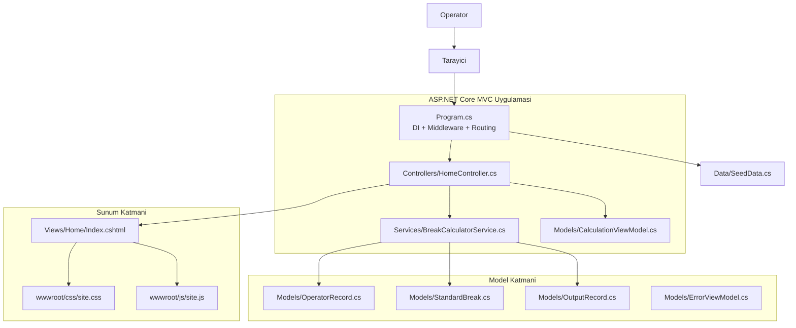
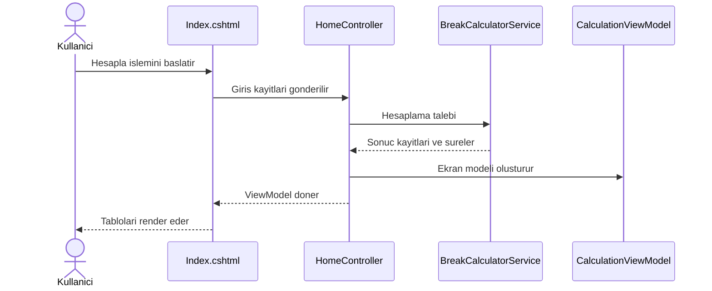

# KivilcimPlus Mimari Semasi

Bu dokuman, uygulamanin katmanlarini, bagimlilik sinirlarini ve tipik istek akis yolunu kisa ve net sekilde aciklar.

## 1) Ust Seviye Gorunum



## 2) Katmanlar ve Sorumluluklar

| Katman | Dosya/Folder | Sorumluluk |
|---|---|---|
| Uygulama baslangici | Program.cs | Servis kaydi, middleware sirasi, route konfigurasyonu |
| Controller | Controllers/ | HTTP istegini alir, servisleri cagirir, ViewModel hazirlar |
| Is kurallari | Services/ | Durus hesaplama mantigi ve donusum kurallari |
| Model | Models/ | Giris, cikis ve ekran model tipleri |
| Sunum | Views/ | Razor ile UI ciktisi olusturma |
| Statik kaynak | wwwroot/ | CSS/JS ve istemci tarafi davranislar |
| Ornek veri | Data/ | Varsayilan/seed veri uretimi |

## 3) Istek Akisi (Hesapla Senaryosu)



## 4) Bagimlilik Kurallari

- Controllers, Services ve Models katmanlarini kullanabilir.
- Services katmani Views katmanina bagimli olmamalidir.
- Views yalnizca ViewModel ve gosterim gerektiren model alanlarini okumali, is kurali calistirmamalidir.
- Data/SeedData yalnizca baslangic asamasinda kullanilmali, hesaplama akisini yonetmemelidir.

## 5) Genisletme Noktalari

- BreakCalculatorService icin arayuz tanimi (ornek: IBreakCalculatorService) eklenebilir.
- Services katmanina birim testler eklenerek hesaplama kurallari guvence altina alinabilir.
- Veri kaynagi buyurse Data katmani repository/persistence ile ayrilabilir.

## 6) Dizin Ozet Haritasi

```text
/
|- Program.cs
|- Controllers/
|- Services/
|- Models/
|- Views/
|- Data/
|- wwwroot/
|- appsettings.json
|- appsettings.Development.json
```
